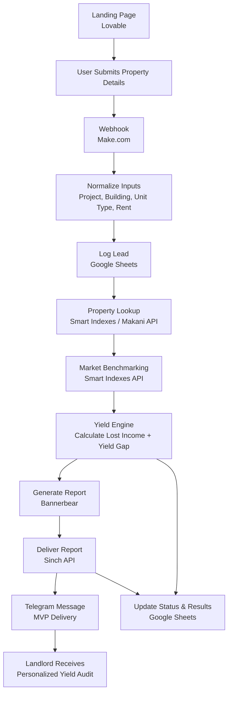

```mermaid
flowchart TD
    A[Landing Page<br/>Lovable] --> B[User Submits Property Details]
    B --> C[Webhook<br/>Make.com]
    C --> D[Normalize Inputs<br/>Project, Building, Unit Type, Rent]
    D --> E[Log Lead<br/>Google Sheets]
    E --> F[Property Lookup<br/>Smart Indexes / Makani API]
    F --> G[Market Benchmarking<br/>Smart Indexes API]
    G --> H[Yield Engine<br/>Calculate Lost Income + Yield Gap]
    H --> I[Generate Report<br/>Bannerbear]
    I --> J[Deliver Report<br/>Sinch API]
    J --> K[Telegram Message<br/>MVP Delivery]
    K --> L[Landlord Receives<br/>Personalized Yield Audit]
    H --> M[Update Status & Results<br/>Google Sheets]
    J --> M
```
